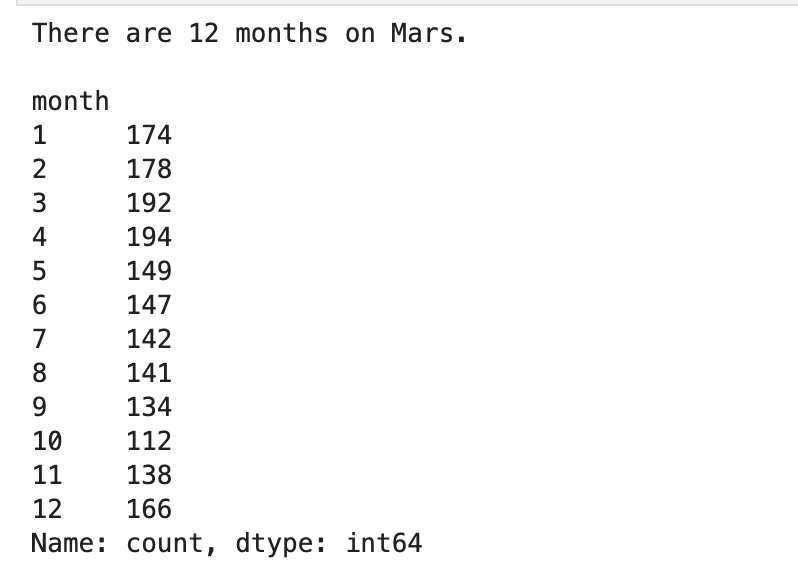

# Mars Data Analysis and Scraping

This project involves two main deliverables: scraping news articles about Mars and analyzing Mars weather data. The primary objective is to collect, process, and visualize data related to Mars from various sources.

## Deliverable 1: Scrape Titles and Preview Text from Mars News Articles

### Objective
To scrape titles and preview text from a website containing Mars news articles.

### Methodology
1. **Initialization**: Use the `splinter` library to automate browser interaction and navigate to the website containing Mars news articles.
2. **Data Extraction**: Employ `BeautifulSoup` to parse the HTML and extract relevant information, including article titles and preview text.
3. **Data Storage**: Collect the data into a structured format and display the first few entries for verification.

### Data Source
- **Mars News Articles**: [Mars News Data](https://static.bc-edx.com/data/web/mars_news/index.html)

### Output

## Deliverable 2: Scrape and Analyze Mars Weather Data

### Objective
To scrape and analyze weather data from Mars, focusing on temperature and atmospheric pressure, and visualize the findings.

### Methodology

1. **Initialization**:
   - Utilize the `splinter` library to automate browser interaction and navigate to the website containing Mars weather data.
   - Employ `BeautifulSoup` to parse the HTML and extract data from the table.

2. **Data Extraction**:
   - Scrape the Mars weather data table from the provided URL.
   - Extract relevant information including terrestrial dates, sol, LS, month, minimum temperature, and atmospheric pressure.

3. **Data Processing**:
   - Convert the extracted data into a Pandas DataFrame for analysis.
   - Change the data types for accurate analysis:
     - Convert 'terrestrial_date' to datetime.
     - Convert 'sol', 'ls', and 'month' to integers.
     - Convert 'min_temp' and 'pressure' to floats.

4. **Analysis**:
   - **Average Minimum Temperature**:
     - Calculate the average minimum temperature for each Martian month.
   - **Coldest and Hottest Months**:
     - Identify the months with the lowest and highest average minimum temperatures.
   - **Average Atmospheric Pressure**:
     - Calculate the average atmospheric pressure for each Martian month.
   - **Earth Days in a Martian Year**:
     - Determine the number of Earth days in a Martian year by dividing the total number of days by the number of months.

5. **Visualization**:
   - Plot the average minimum temperatures by Martian month.
   - Plot the average atmospheric pressure by Martian month.
   - Plot the minimum temperatures over terrestrial days to visualize temperature variations over time.

### Data Source
- **Mars Weather Data**: [Mars Weather Data](https://static.bc-edx.com/data/web/mars_facts/temperature.html)

### Outputs

**1. Number of Months on Mars**

**2. Number of Martian Days**
A total of 1867 Martian days' worth of data.

### 3. Average Minimum Temperature by Month

### 4. Coldest and Hottest Months

### 5. Average Atmospheric Pressure by Month

### 6. Terrestrial Days in a Martian Year

### Conclusions

1. **Temperature Trends**: The analysis reveals distinct seasonal variations in Martian temperatures. The coldest month occurs at the start of the Martian year, while the warmest month is at the end. This temperature variation is indicative of the planet’s seasonal changes and helps in understanding Martian climate patterns.

2. **Pressure Trends**: The atmospheric pressure on Mars also exhibits seasonal fluctuations, with noticeable variations throughout the Martian year. The pressure generally increases towards the end of the Martian year.

3. **Martian Year Calculation**: The average number of Earth days in a Martian year is approximately 687. This indicates that Martian years are considerably longer than Earth years, which is a crucial factor in planning long-term missions and studying Martian seasons.

### Bonus: 

- **Data Visualization**: The visualizations effectively illustrate the variations in temperature and pressure across Martian months, providing a clear understanding of the planet’s climatic conditions.

- **Research Impact**: This analysis contributes to a deeper understanding of Mars' weather patterns and climate. Such insights are valuable for future Mars missions, potential habitability studies, and long-term planning for exploration.

- **Future Implications**: The ability to analyze and interpret Martian weather data enhances our preparation for human missions to Mars and helps in assessing the planet’s suitability for future exploration and habitation.
